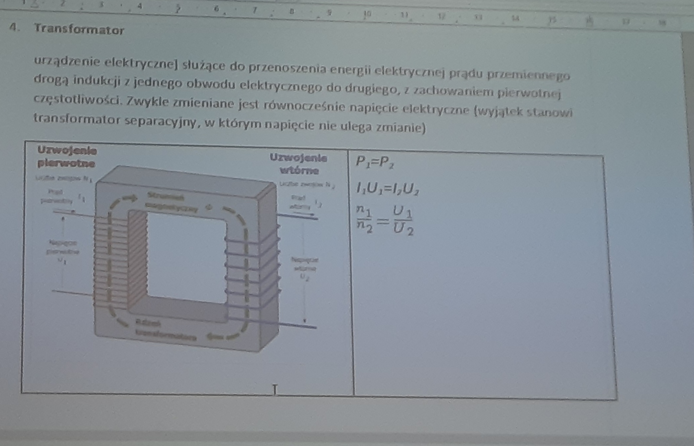

Z4 17.12.2023
========================
T: Transformator.
---
Pytania do siebie
    - Kiedy pojawia się pole magnetyczne
    - Jak działa cewka
    - Tranzystor 

4. Transformator 
    * Służy do przenoszenia energii elektrycznej prądu przemiennego drogą indukcji z jednego obwodu elektrycznego do drugiego, z zachowaniem pierwotnej częstotliwości. Zwykle zmieniane jest równocześnie napięcie elektryczne (wyjątek stanowi transformator separacyjny, w którym napięcie nie ulega zmianie)
    * Jeśli mamy zmienne pole magnetyczne to to tworzy zmienne pole energetyczne i na odwrót
    * w przypadku prądu stałego, on tworzy stałe pole magnetyczne.
    * Aby coś wytworzyć potrzebujemy aby atomy się ruszały
    * Przeciwnie nie wzbudzane pole
    * Opór ulega zwiększeniu gdy zwiększamy częstotliwość
    * XL = 2PifL
    * y = u/R
    * Filtr LC jest używany przy wyjściach falowników (np. panele fotowoltaiczne)
    * Ma to na celu wyeliminowanie zakłóceń przy wyjściach z układu
    * Kondenstator stabilizuje napięcie na wyjściu, dzięki czemu napięcie wyjściowe nie będzie zerowe
    
    * Jeśli wyrzucimy diode i cewke i wstawimy filtr RC (zdjęcie z kwadratem zamiast zawijasem) to on po prostu wyeliminuje nam wysokie częstotliwości 
    
    * Oprócz separacji transofmrator pozwala na zmiejszenie i zwiększenie napięcia wyjściowego. To co wytworzymy i to co odbieramy będzie sobie równe
    * pwe == pwy (moc wejściowa jest równa mocy wyjściowej)
    * Po przez zjawiska elektromagnetycznej uzyskujemy równowagę między prądem wejściowym i wyjściowym
    * Jeśli damy dużą moc wejściową ale nie zostanie ona spożytkowana to ona wróci do źródła i spali nam układ
    * Uw wejściowe == U wyjściowe
    
    * Dioda powoduje przepływ prądu w tylko jednym kierunku a napięcie zwiększa tranformator

3. Transoptor
    * półprzewodnikowy element optoelektroniczny składający się z co najmniej jednego jednego fotoemitera i co najmniej jednego fotodetektora umieszczonych we wspólnej obudowie.
    * Transoptor szczelinowy (przykład) - za pomocą jego można stworzyć system ochronny który zadziała jak dojdzie do niego światło. Z jego użyciem i kilkoma bateriami możemy zabezpieczyć cały dom za cenę 40/50 złotych

2. Termistor
    * Wartość rezystancji zależy od ciepła. Można użyć jako czujnik temperatury. Są trzy rodzaje ogólne, nisko temperaturowym, wysoko temperaturowy, o określonej temperaturze

1. Warystor
    * Rezystancja zależy od napięcia w układzie

Tranzystor - czyli transformacja rezystancji
--
* Dioda to element półprzewodnikowy o minimalnej wartości napięcia która pozwala aby prąd płynął dalej. Z założenia napięcie musi wynosić minimów 0,7V (w układach Si). W gelwanowych 0/1-0,2V (Ge)
* Do bramek logicznych używamy tranzystory unipolarne gdyż one "działają na napięciu wejściowym"?? Sprawdź

* Nie można tworzyć tranzystora z dwóch diod
* Kolektor, Baza, Emiter - poszczególne elektrony (tranzystory n,p,n i p,n,p)
* Możemy zamienić miejscami emiter i kolektor ale baza musi być na swoim miejscu.
* Tranzystor n-p-n (zdjęcie)
* Tranzystor jest polarny bo ma dwa bieguny, unipolarny jest jedno biegunowy
* W unipolarnym żaden prąd nie płynie przez tranzystor, a w bipolarnym płynie
* Obwód z n-p-n Yb = 10mA
* Ye = Yc + Yb
* B = Yc/Yb = 100 hpe (duże, zazwyczaj wzmocnienie wynosi 15 lub 20)
* daje to wzmocnienie 1/0,010 = 100
* Napięcie na wyjściu nie może być większe niż napięcie zasilające

* Jeśli tranzystor pozwala na 1A, a napięcie 15V to musimy dobrać odpowiedni rezystor (R=u/y czyli 15V/1A = 15Om)
* Dla 10mA i 5V R = 5V/10mA = 5v/0,01A = 500Om 
* Yb = (Ubb - 0,7) / Rb
* Stan nasycenia - to napięcie przy którym już nie wytworzy więcej prądu
* A stan między minimalnym i między nasycenia to jest to stan pracy
* Po przez wsadzenie wentylatora do obwodu, po przez zmianę rezystancji na wejściu zmienia się prąd płynący przez wentylator co może go wyłączyć bądź zwiększać jego obroty. Działa to dla układów które reagują na zmianę prądu czyli silniki
* (zdjęcie) jest to tranzystor zasilany dwoma wejściami 

* Nowe zdjęcie UR2 =  R2 / (R1+R2) * YR2
     - układ z jednym zasilaniem (+/-)
* W budowie wzmacniacza akustycznego wykorzystamy kondensator 
* Aktualizacja zdjęcia, dodano kondensator 

Tranzystor unipolarny
--
* Symbol tranzystora unipolarnego jest bardzo podobny do symbolu kondensatora
* Znajduje się w nim tlenek krzemu
* Użyjemy go na elementy które reagują na napięcie. Dzięki niemu za pomocą napięcia niskiego możemy sterować układem napięcia wysokiego
* Wykorzystanie: Wzmacniacze operacyjne

Wzmacniacz operacyjny
---
* Żaden prąd nie wchodzi do wzmacniacza
* Napięcie wejściowe będzie równe bądź większe od wyjściowego
* Daje on wzmocnienie "K" które wynosi: K = 10000
* Jeśli damy dzielnik napięcia na wyjściu to uzyskamy efekt wzmacniacza nieodwracający (nowe zdjęcie z R1)
    * Zasilanie ujemne wykorzystujemy np. przy noise canceling w słuchawkach bo to aktywny sposób redukcji częstotliwości 